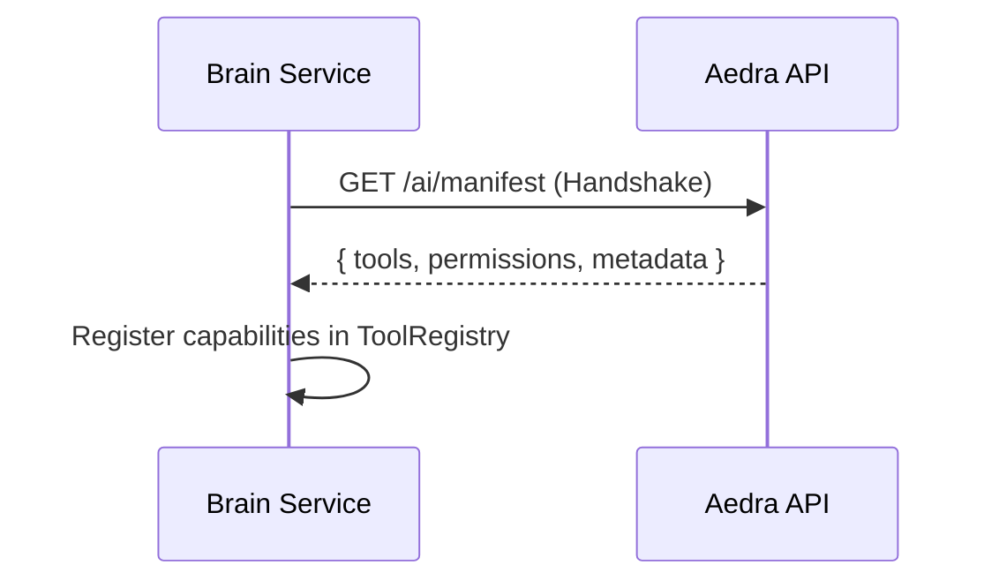
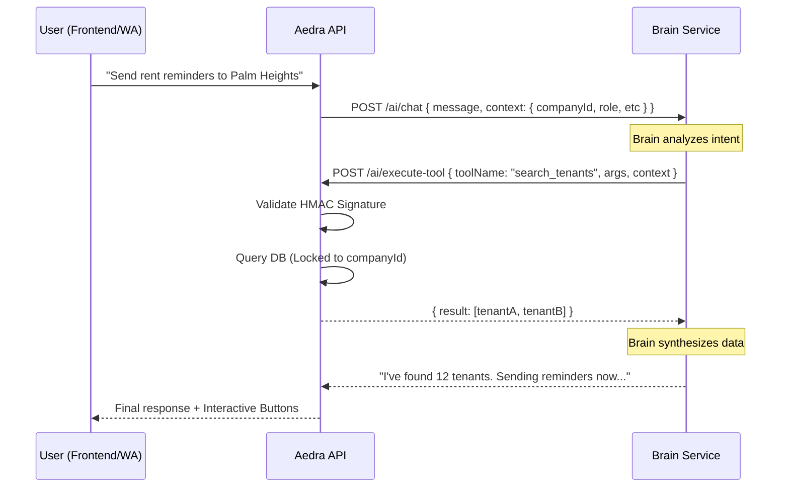

# Architecture: The Semantic Bridge

This document outlines the **Semantic Bridge** architecture—the high-fidelity protocol that enables the **Aedra API** (The Action Layer) and the **Brain Reasoning Engine** (The Intent Layer) to collaborate while maintaining strict multi-tenant isolation and security.

---

## 1. Core Paradigm: Intent vs. Action

The Aedra ecosystem is decoupled into two fundamental domains:
- **Aedra (Local Host)**: The source of truth. Owns the database, file system, and business logic. It provides **Tools**.
- **Brain (Reasoning Engine)**: The cognitive center. It understands user intent, breaks down complex goals into steps, and decides which **Tools** to call.

---

## 2. Interaction Flow: The Tool Discovery & Execution

Communication is bidirectional and follows a request-callback pattern.

### Step 1: Handshake & Manifest Discovery
Upon startup, the Aedra server exposes its capabilities via a **Manifest**. The Brain polls this endpoint to understand what it can do within the Aedra environment.



### Step 2: Goal Orchestration (The Intent Loop)
When a user interacts with Aedra (Web or WhatsApp), Aedra sends the message and a **Signed Context** to the Brain.



---

## 3. High-Fidelity Security

### 3.1 HMAC SHA-256 Signing
Every tool call from the Brain must be authenticated via the `X-Brain-Signature` header.
- **Algorithm**: `HmacSHA256`
- **Secret**: `BRAIN_SHARED_SECRET`
- **Payload**: The JSON string of the request body.

**Validation in Aedra:**
```typescript
const expectedSignature = crypto
  .createHmac('sha256', SHARED_SECRET)
  .update(JSON.stringify(body))
  .digest('hex');

if (signature !== expectedSignature) throw new UnauthorizedException();
```

### 3.2 The Signed Context Loop (Multi-tenancy)
Multi-tenancy is enforced through **Context Propagation**.
1. **Initial Context**: Aedra sends `companyId` and `userId` to the Brain.
2. **Persistence**: The Brain maintains this context in its thread memory.
3. **Restoration**: The Brain sends the *exact same context* back in the `execute-tool` request.
4. **Enforcement**: Aedra's `AiReadToolService` uses the `companyId` from the callback context to filter all Prisma queries.

---

## 4. Governance: The Identity Guard

To prevent "Cross-Tenant Leaks" (even if the Brain hallucinates an ID), Aedra implements an **Identity Guard**:
- **Automatic Scoping**: If a `TENANT` calls a tool without an ID, Aedra automatically injects their own `tenantId` from the session context.
- **Strict Conflict Detection**: If the Brain attempts to access `tenant_B` data during a session locked to `tenant_A`, Aedra rejects the tool execution with a `CONTEXT_CONFLICT` error.

---

## 5. Manifest Standards: Adding New Tools

Engineers adding new capabilities to Aedra must:
1. Define the tool schema in `ai-tool-definitions.ts`.
2. Map the tool in `AiToolRegistryService`.
3. Implement the tool logic in `AiReadToolService` or `AiWriteToolService`, ensuring it accepts and utilizes the `context` for data isolation.
