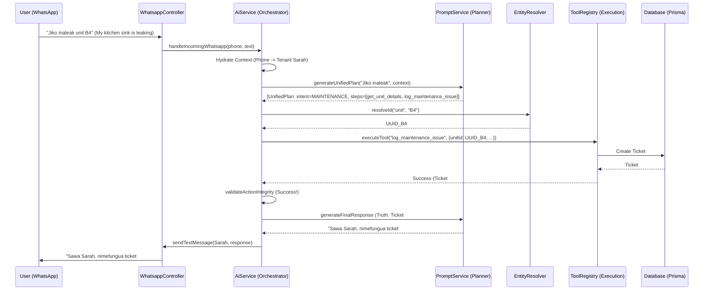

# Aedra Technical Architecture Guide

Aedra is an AI-native property management system designed for high-integrity, multi-persona operations (Tenants, Landlords, Staff). This document details its core architectural pillars and workflows.

## 1. Core Architectural Pillars

### AI Orchestration (The Brain)
Aedra uses a **Unified Agentic Orchestrator** ([AiService](file:///home/chris/aedra/api/src/ai/ai.service.ts#48-1200)) that separates reasoning from execution. It operates in four deterministic phases:

1.  **Auth-First Hydration:** Upon message ingress (WhatsApp/Web), the system identifies the sender via phone/session. It automatically hydrates the context with `tenantId`, `unitId`, and `propertyId` to ensure the AI "remembers" who it's talking to without asking.
2.  **Unified Planning (v5.2):** [AiPromptService](file:///home/chris/aedra/api/src/ai/ai-prompt.service.ts#10-930) uses **Gemini 2.0 Flash** (with Groq fallback) to transform natural language into a structured JSON [UnifiedPlan](file:///home/chris/aedra/api/src/ai/ai-prompt.service.ts#397-472). This plan contains an `Intent` (e.g., `MAINTENANCE_REQUEST`) and a sequence of `steps` (tools).
3.  **Hardenened Execution Loop:** The orchestrator executes tools in order, resolving dependencies (`dependsOn`) and performing just-in-time **Entity Resolution** (e.g., converting "Unit B4" to a UUID via [AiEntityResolutionService](file:///home/chris/aedra/api/src/ai/ai-entity-resolution.service.ts#12-231)).
4.  **Truth-First Integrity Pipeline:** Before rendering a response, the system validates the "Chain of Truth":
    *   **Action Integrity:** AI is strictly forbidden from using completion words (e.g., "fixed", "resolved") unless the tool returned a `COMPLETE` status in the `TruthObject`.
    *   **Gated Rendering:** High-stakes intents (Payments, Maintenance) use **Deterministic Templates** to prevent hallucinations. Low-stakes intents use LLM-rendering with injected truth data.

### Messaging Ingress (The Interface)
WhatsApp is the primary interaction layer, integrated via the **Meta Business API**:
-   **Webhook Processing:** `/whatsapp/webhook` handles incoming text, voice (transcribed via Groq/Gemini), and media.
-   **Idempotency:** WhatsApp Message IDs are cached in Redis to prevent duplicate processing.
-   **Interactive Layer:** Supports Buttons, Lists, and Flows for deterministic user selections (e.g., "Select Property", "Confirm Amount").

### Financial & Recovery Engine (The Lifeblood)
-   **M-Pesa Integration:** Real-time rent reconciliation via Safaricom C2B webhooks (`/mpesa/webhook/c2b`).
-   **Idempotency & Reconciliation:** Every transaction is tied to a `TransID`. Unmatched payments are flagged for manual admin reconciliation via WhatsApp alerts.
-   **Commission Engine:** Automatically records manageent fees on every rent payment.

---

## 2. Technology Stack

| Layer | Technology |
| :--- | :--- |
| **Backend** | Node.js, NestJS, TypeScript |
| **Database** | PostgreSQL |
| **ORM** | Prisma |
| **Cache & Queue** | Redis, BullMQ |
| **AI Models** | Gemini 2.0 Flash (Primary), Groq (High-Speed Text/Voice) |
| **Messaging** | Meta Business API (WhatsApp) |
| **Payments** | Safaricom M-Pesa Daraja API |
| **Infrastructure** | Docker, Docker-compose |

---

## 3. Workflow Example: Maintenance Request

---

## 4. Key Operational Standards

1.  **Strict Isolation:** Multi-tenancy is enforced at the `companyId` level in all Prisma queries.
2.  **Graceful Degradation:** Redis or Groq failures trigger automatic in-memory fallbacks or Gemini takeovers without service interruption.
3.  **Human Quorum:** Sensitive AI actions (e.g., massive refunds) require a **Quorum Approval** from an admin via a WhatsApp deep link before execution.
